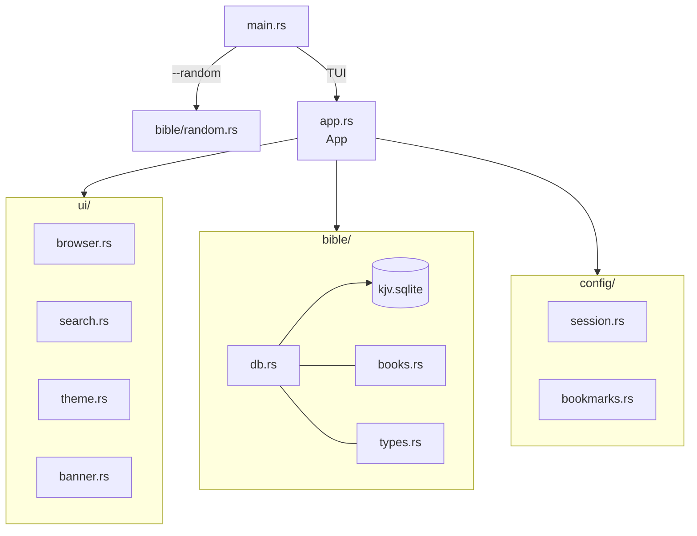

# Architecture

_Last updated: 2026-04-01_

## Overview

Selah is a fully offline terminal Bible reader written in Rust. It embeds the KJV Bible as a SQLite database compiled into the binary, renders a 4-panel TUI via ratatui/crossterm, and persists the user's reading position between sessions.

## System Design



## Components

### main.rs — Entry Point

Parses CLI args via clap. If `--random` is passed, prints a random verse and exits. Otherwise, initializes the terminal and runs the TUI event loop.

### app.rs — Application State Machine

Central controller. Owns the SQLite connection, active theme, `BrowserState`, and `SearchState`. Handles all key and mouse events and dispatches them to the appropriate sub-state. On clean exit, saves `SessionState` to disk.

### ui/browser.rs — 4-Panel Reader

Manages the Books / Chapters / Verses / Scripture panels. Implements `hit_test()` for mouse click routing and handles per-panel scroll offsets. Renders via ratatui widgets.

### ui/search.rs — Search Overlay

Manages the FTS5 search UI. Activated by `/`, renders an overlay with a text input and result list. Selecting a result calls `jump_to_verse()` on `BrowserState`.

### ui/theme.rs — Theme System

Defines `ThemeName` (Slate, Midnight, Parchment, Gospel, Terminal), the `Theme` struct with semantic color tokens, `get_theme()`, and `interpolate_color()`. Active theme is toggled at runtime with `t`.

### ui/banner.rs — Splash Banner

Placeholder rendering for the splash screen (Phase 8).

### bible/db.rs — Data Access

Opens the embedded SQLite database from a temp file on startup. Provides: `get_chapter()`, `get_verse()`, `search()` (FTS5), `get_random_verse()`. Builds the FTS5 index at runtime.

### bible/books.rs — Book Metadata

`BOOKS` — static array of 66 book names in canonical order. `book_name()` returns a name by index.

### bible/types.rs — Data Types

`Verse`, `Chapter`, `SearchResult` — the core data shapes passed between the DB layer and UI.

### config/session.rs — Session Persistence

`SessionState` (book index, chapter, verse). `load()` reads from the platform data directory; `save()` writes on clean exit.

## Data Flow

1. Startup: `main.rs` writes `data/kjv.sqlite` (embedded via `include_bytes!`) to a temp file and opens a `rusqlite::Connection`. `SessionState::load()` restores the last reading position.
2. Event loop: crossterm polls for key/mouse events. `App` dispatches them — navigation updates `BrowserState`, which triggers DB queries for the new chapter/verse list.
3. Render: each tick, ratatui renders all visible panels from the current `BrowserState` and `SearchState`.
4. Exit: `SessionState::save()` writes the current position to the platform data directory.

## Key Design Decisions

| Decision | Rationale |
|----------|-----------|
| Embed SQLite via `include_bytes!` | Single binary, fully offline, no install steps |
| FTS5 index built at runtime | Avoids storing derived data in the binary; index is fast to build |
| Semantic theme tokens | Decouples color values from widget code; makes theming consistent |
| `rusqlite` with `bundled` feature | No system SQLite dependency; compiles on any supported platform |
| `directories` crate for session path | Correct platform data dir on macOS and Linux without hardcoding |

See `docs/decisions.md` for the full ADR log.

## Tech Stack

| Layer | Technology |
|-------|------------|
| Language | Rust |
| TUI framework | ratatui + crossterm |
| Database | SQLite via rusqlite (`bundled`) |
| CLI | clap |
| Session storage | JSON via `serde_json` + `directories` |
| Bible data source | scrollmapper/bible_databases |

## Directory Structure

```
selah/
├── src/
│   ├── main.rs
│   ├── app.rs
│   ├── cli.rs
│   ├── ui/
│   │   ├── mod.rs
│   │   ├── banner.rs
│   │   ├── browser.rs
│   │   ├── search.rs
│   │   ├── bookmarks.rs  (stub)
│   │   └── theme.rs
│   ├── bible/
│   │   ├── mod.rs
│   │   ├── db.rs
│   │   ├── books.rs
│   │   ├── types.rs
│   │   └── random.rs
│   └── config/
│       ├── mod.rs
│       ├── session.rs
│       └── bookmarks.rs  (stub)
├── data/
│   └── kjv.sqlite
├── docs/
│   ├── architecture.md
│   ├── tasks.md
│   ├── decisions.md
│   ├── workflow/
│   ├── plans/
│   ├── specs/
│   └── technical/
├── Cargo.toml
└── Cargo.lock
```

## Related Documents

- `docs/technical/` — Domain-specific reference
- `docs/decisions.md` — Architecture Decision Records
- `docs/plans/v0.1.0-implementation.md` — Phased build plan
